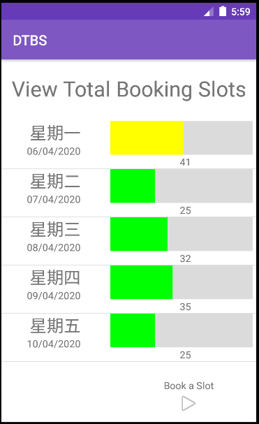

# **This is the assignment 1 for ISCG7424** 

## &emsp;&emsp; from Feng Xu  

## &emsp;&emsp; 1517253

# **The following content is the specification of the DTBS app**

+ ## **Over All** 
&emsp;&emsp; This app is designed for Drivers Licence Test Booking System.

&emsp;&emsp; Because of no persisted data, the author mocks some random data to show the plot when it start. 

&emsp;&emsp; Demostration video is [here](https://youtu.be/Vcnzi1bMI20)

+ ## **Home**
&emsp;&emsp; Home Page is used to display the overall summary in the coming five workdays' booking info.

&emsp;&emsp; If the booking percent is greater than 75, then the chart is red.

&emsp;&emsp; If the booking percent is greater than 50, then the chart is yellow.

&emsp;&emsp; Other wise it is green.

&emsp;&emsp; Click the button of "Book a Slot" can go into the Book a slot page.

&emsp;&emsp; 

+ ## **Book a slot**
&emsp;&emsp; This page is designed for booking a slot. 

&emsp;&emsp; User can input a driver licence, select a Date within a datepicker, and choose a time in dropdown list.

&emsp;&emsp; After cliking the submit button, it will book a slot in db. If failed, it will pop-up a message to notify &&&emsp;&emsp; failed through toast.

&emsp;&emsp; If succeed, it will pop-up a message of success. And after a few seconds it will go into next page, View slots by driver

&emsp;&emsp; 

+ ## **View slots by driver**

&emsp;&emsp; This page is designed for view slots by a driver.

&emsp;&emsp; The first is an autocompletetextview, which gives users indication about all the booked user driver licences.

&emsp;&emsp; The main part displays the booking slot's detail.

&emsp;&emsp; 

+ ## **View slots by day**
&emsp;&emsp; This page is designed for view daily slots. 

&emsp;&emsp; Each item represents the booking info in an hour.

&emsp;&emsp; The color logic is the same as home page.

&emsp;&emsp; 

